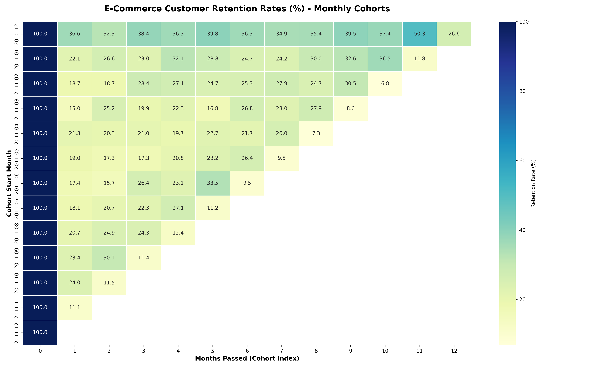
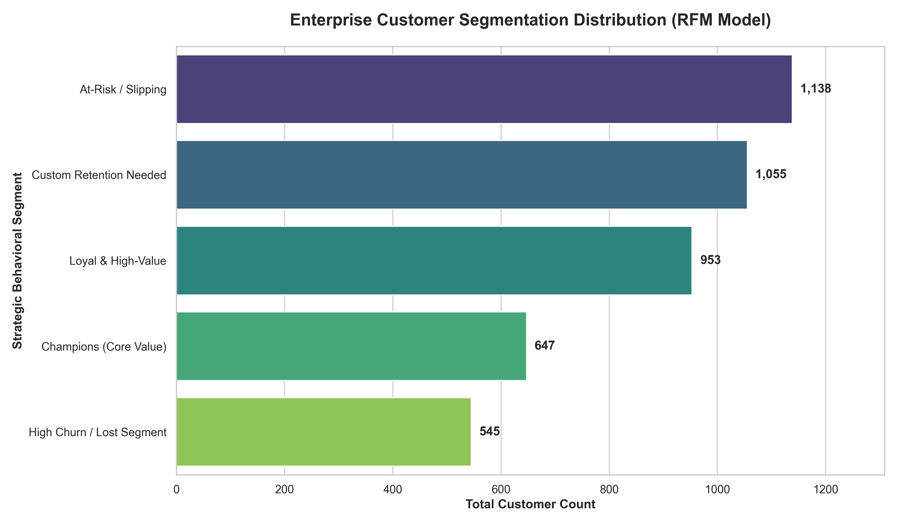

# E-Commerce Customer Churn & Cohort Analytics Engine

## 📌 Project Overview
This production-grade data science project implements a programmatic data pipeline to analyze customer retention and behavioral patterns for a global online retailer. Utilizing over **500,000 rows of transactional records** from the UCI Machine Learning Repository, the engine processes raw data, builds longitudinal cohort matrices, and applies a statistical **RFM (Recency, Frequency, Monetary) Segmentation Model** to identify churn risks and high-value customer segments.

---

## 🏗️ System Architecture & Data Pipeline
The project is built using a clean, modular script architecture designed for local execution and seamless version control tracking:

1. **`download_data.py`**: Automated ingestion pipeline that streams raw transactional records from a remote repository, handles complex text decoding (`ISO-8859-1`), and caches data locally.
2. **`clean_data.py`**: Data auditing and purification engine. It isolates missing records, strips string noise, filters transaction anomalies (such as negative quantities and cancellations), and outputs a pristine database of **397,884 verified records**.
3. **`cohort_analysis.py`**: Computes time-delta indexes to track retention decay rates across monthly customer cohorts.
4. **`rfm_analysis.py`**: Aggregates customer records into localized behavioral dimensions and applies quantile-based statistical scoring (1–5) to rank user value.
5. **`visualize_cohorts.py` & `visualize_rfm.py`**: Renders production-ready visual assets for executive presentation.

---

## 📊 Deep-Dive Analytical Insights

### 1. Cohort Retention Heatmap
By tracking users based on their initial purchase month, the cohort engine reveals key customer decay patterns:
* **The Month-1 Churn Gap**: Across almost all cohorts, there is a sharp drop-off in user activity between Month 0 and Month 1 (dropping down to as low as 15%). This signals a crucial need for optimized post-purchase re-engagement.
* **The Holiday Surge Trend**: The `2010-12` cohort exhibits a massive spike in retention at **Month 11 (50.3%)**, capturing distinct, recurring seasonal shopping behaviors exactly one year later.

### 2. Strategic RFM Customer Distribution
The statistical engine categorized the active customer base of **4,338 unique clients** into distinct actionable corporate brackets:
* **Champions (647 users)**: High-frequency, high-spending core assets with perfect behavioral metrics.
* **At-Risk / Slipping (1,138 users)**: The largest customer volume block. These represent high past value but severe current recency decay, indicating prime targets for proactive marketing win-back campaigns.

---

## 🛠️ Tech Stack & Environment
* **Language**: Python 3.12+
* **Core Libraries**: Pandas, NumPy, OS, DateTime
* **Data Visualization**: Seaborn, Matplotlib
* **Version Control**: Git / GitHub